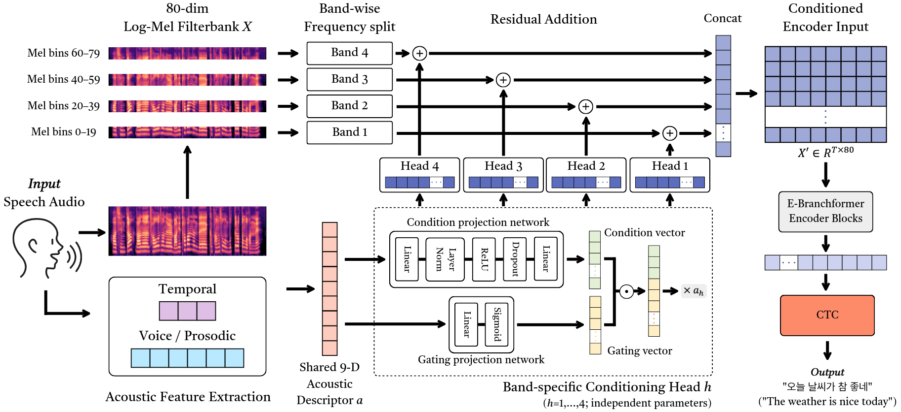
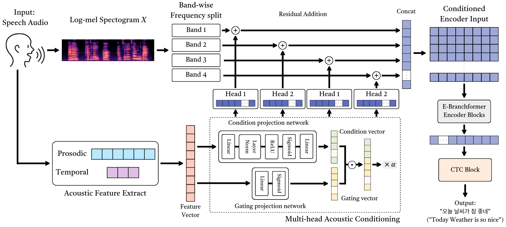

# MULTI-HEAD ACOUSTIC CONDITIONING FOR LOW-INFORMATION CONVERSATIONAL ASR

[[English]](#English) [[Korean]](#Korean)

---

**English**<a name="English"></a>

This repository was implemented to support the reproducibility of the paper. <br />

The experimental results can be reproduced by following the steps below. <br />

**Note**: This study used a Korean conversational speech dataset provided by the National Institute of Korean Language. [National Institute of Korean Language](https://kli.korean.go.kr/corpus/main/requestMain.do)

---

## Research Content

Conversational automatic speech recognition (ASR) remains challenging for utterances with limited lexical content. We propose Band-wise Acoustic Conditioning (BAC), which uses a nine-dimensional, reference-free acoustic descriptor to generate gated residual corrections for four frequency bands before a shared encoder. On a large-scale Korean conversational corpus, BAC reduces character error rate (CER) from 11.49% to 8.33%, word error rate from 25.99% to 20.00%, and a heuristic hallucination-like output rate from 2.23% to 1.41% with E-Branchformer CTC. The largest absolute CER reduction occurs in long-sparse utterances with longer duration but few reference tokens. BAC also improves recognition with a frozen pretrained Whisper backbone, suggesting that its benefit is not specific to E-Branchformer. These results support utterance-level acoustic conditioning for improving conversational ASR, particularly for lexically sparse speech.


---

## Low-Information Speech

Recent advances in large-scale speech data, Transformer-based models, and pretraining have substantially improved Automatic Speech Recognition (ASR) performance. However, hallucination and recognition instability remain important challenges even in modern ASR systems. In spontaneous everyday conversations, irregular speech patterns such as hesitations and elongated speech frequently occur, and high recognition error rates have been reported for short utterances with limited lexical cues.

This study connects the use and adaptation of acoustic information with the amount of lexical information in conversational utterances and investigates whether explicitly incorporating utterance-level acoustic/prosodic characteristics can reduce recognition errors when lexical information is limited. To this end, utterances with short duration or a small number of reference tokens are defined as **low-information speech**, and short-dense, short-sparse, and long-sparse conditions are distinguished to analyze conditioning effects according to utterance duration and lexical sparsity.

In this study, let $d(u)$ denote the duration of utterance $u$ and $t(u)$ denote its reference token count. Low-information speech is defined as an utterance satisfying $d(u)\leq2$ s or $t(u)\leq2$ [Lin et al., (2022)](https://www.isca-archive.org/interspeech_2022/lin22b_interspeech.html), [Linke et ., (2025)](https://www.isca-archive.org/interspeech_2025/linke25_interspeech.html).

This definition includes `short utterances`, `fillers`, `hesitations`, `elongated speech`, and `other conversational utterances with limited lexical content`.



<p align='center'>Figure 1. Examples of Recognition Instability under Low-Information Speech.</p>


---

## Acoustic Conditioning



<p align='center'>Figure 2. Overall architecture of the proposed framework.</p>

Therefore, this study proposes **BAC** to mitigate recognition instability in low-information conversational speech. As shown in Figure 2, a nine-dimensional utterance-level acoustic descriptor extracted from the input speech is used to apply utterance-dependent residual corrections to an 80-dimensional log-Mel filterbank representation. Four independent conditioning heads generate correction values for each frequency band, and the conditioned representation is converted into the final transcription through a shared E-Branchformer encoder and CTC.

The descriptor consists of three temporal features, `silence ratio`, `number of pauses`, and `mean pause duration`, and six voice/prosodic features, `fundamental frequency (F0) standard deviation`, `F0 range`, `root-mean-square (RMS) energy`, `harmonic-to-noise ratio (HNR)`, `jitter`, and `shimmer`.

## Dataset

The dataset composition after preprocessing is shown below.

| Split | Utterances | Speaker | Ratio |
|---|---:|---:|---:|
| Train | 1,283,280 | 3,153 | 69.6% |
| Validation | 179,058 | 443 | 9.7% |
| Test | 381,816 | 922 | 20.7% |
| $\hookrightarrow$ Low-Information | 121,705 | - | 31.9 (test) |
| $\hookrightarrow$ Normal | 260,111 | - | 68.1 (test) |
| Total | 1,844,154 | 4,511 | 100% |

For evaluation, 1,521 test utterances from five speakers also appearing in the training or development split were excluded to avoid speaker leakage. All reported test results are therefore computed on 380,295 utterances.

### 1. Raw Speech Corpus (Baseline)

Dataset: [LINK:: Raw Datasets](https://zenodo.org/records/20421255)

`/raw` Contents:

```
raw/
├── train
├── dev
└── test
```

Contains: `wav.scp`, `text`, `utt2spk`, `speaker metadata`, `FLAC audio`

Used by: Encoder Baseline models

### 2. Acoustic Features (BAC)

Dataset: [LINK:: Acoustic Features Datasets](https://zenodo.org/records/20421255)

`/hallu_acoustic_feats` Contents:

```
hallu_acoustic_feats/
├── train
├── dev
└── test
```

Contains: `acoustic_feats.scp`, `utterance-level acoustic features (.npy)`

Used by: Multi-head Acoustic Conditioning (main)

**#### 2.1. Temporal Acoustic Features (Ablation)**

Dataset: [LINK:: Temporal Acoustic Features Datasets](https://zenodo.org/records/20421255)

**#### 2.2. Voice Quality Features (Ablation)**

Dataset: [LINK:: Voice Quality Features](https://zenodo.org/records/20421255)

`/hallu_acoustic_feats_temporal` and `/hallu_acoustic_feats_voice` used for: Ablation experiments only.

## Training and Reproducibility

### Baseline Models

This repository provides training and decoding scripts:

- Transformer + CTC
- E-Branchformer + CTC

Training: `./run_training.sh` </br>
Test decoding: `./run_decode.sh` </br>
Baseline models use: `/raw` dataset

### BAC + E-Branchformer + CTC

Uses: `/hallu_acoustic_feats` dataset only.

Collect stats:

```
CUDA_VISIBLE_DEVICES=0 python3 -m espnet2.bin.asr_train \
  --collect_stats true \
  --allow_variable_data_keys true \
  --use_preprocessor true \
  --bpemodel none \
  --token_type char \
  --token_list data/token_list/char/tokens.txt \
  --non_linguistic_symbols none \
  --cleaner none \
  --g2p none \
  --train_data_path_and_name_and_type dump/raw/train/wav.scp,speech,sound \
  --train_data_path_and_name_and_type dump/raw/train/text,text,text \
  --train_data_path_and_name_and_type dump/hallu_acoustic_feats_fix/train/acoustic_feats.scp,acoustic_feat,npy \
  --valid_data_path_and_name_and_type dump/raw/dev/wav.scp,speech,sound \
  --valid_data_path_and_name_and_type dump/raw/dev/text,text,text \
  --valid_data_path_and_name_and_type dump/hallu_acoustic_feats_fix/dev/acoustic_feats.scp,acoustic_feat,npy \
  --config conf/tuning/train_asr_ebranchformer_ctc_hallu_fix.yaml \
  --output_dir exp/asr_stats_ebranchformer_hallu_fix \
  --ngpu 1 \
  2>&1 | tee logs/collect_stats_ebranchformer_hallu_fix_$(date +%Y%m%d_%H%M%S).log
```

Training:

```
CUDA_VISIBLE_DEVICES=0 python3 -m espnet2.bin.asr_train \
--allow_variable_data_keys true \
--use_preprocessor true \
--bpemodel none \
--token_type char \
--token_list data/token_list/char/tokens.txt \
--non_linguistic_symbols none \
--cleaner none \
--g2p none \
--train_data_path_and_name_and_type dump/raw/train/wav.scp,speech,sound \
--train_data_path_and_name_and_type dump/raw/train/text,text,text \
--train_data_path_and_name_and_type dump/hallu_acoustic_feats_fix/train/acoustic_feats.scp,acoustic_feat,npy \
--valid_data_path_and_name_and_type dump/raw/dev/wav.scp,speech,sound \
--valid_data_path_and_name_and_type dump/raw/dev/text,text,text \
--valid_data_path_and_name_and_type dump/hallu_acoustic_feats_fix/dev/acoustic_feats.scp,acoustic_feat,npy \
--train_shape_file exp/asr_stats_ebranchformer_hallu_fix/train/speech_shape \
--train_shape_file exp/asr_stats_ebranchformer_hallu_fix/train/text_shape \
--train_shape_file exp/asr_stats_ebranchformer_hallu_fix/train/acoustic_feat_shape \
--valid_shape_file exp/asr_stats_ebranchformer_hallu_fix/valid/speech_shape \
--valid_shape_file exp/asr_stats_ebranchformer_hallu_fix/valid/text_shape \
--valid_shape_file exp/asr_stats_ebranchformer_hallu_fix/valid/acoustic_feat_shape \
--config conf/tuning/train_asr_ebranchformer_ctc_hallu_fix.yaml \
--output_dir exp/asr_ebranchformer_ctc_hallu_multihead \
--ngpu 1 \
2>&1 | tee logs/train_asr_ebranchformer_ctc_hallu_multihead_$(date +%Y%m%d_%H%M%S).log
```

Test:

```
CUDA_VISIBLE_DEVICES=0 python3 -m espnet2.bin.asr_inference \
--allow_variable_data_keys true \
--batch_size 1 \
--ngpu 1 \
--data_path_and_name_and_type dump/raw/test/wav.scp,speech,sound \
--data_path_and_name_and_type dump/hallu_acoustic_feats_fix/test/acoustic_feats.scp,acoustic_feat,npy \
--key_file dump/raw/test/keys.txt \
--asr_train_config exp/asr_ebranchformer_ctc_hallu_multihead/config.yaml \
--asr_model_file exp/asr_ebranchformer_ctc_hallu_multihead/valid.loss.best.pth \
--ctc_weight 1.0 \
--beam_size 1 \
--maxlenratio 1.0 \
--output_dir exp/asr_ebranchformer_ctc_hallu_multihead/direct_gpu_test \
2>&1 | tee logs/test_asr_ebranchformer_ctc_hallu_multihead_test_$(date +%Y%m%d_%H%M%S).log
```

Note: For reproduction, the hallu_acoustic_feats dataset must be moved to `/espnet_asr/recipe/asr1/dump`. <br />

(e.g., `/espnet_asr/recipe/asr1/dump/hallu_acoustic_feats`)

### Evaluation

Decoding is performed on the full processed test split (381,816 utterances). Before scoring, test utterances from speakers appearing in the training or development split are excluded to avoid speaker leakage.

Generate the evaluation subset:

```

```

Filter the decoded hypotheses using the evaluation IDs:

```
python local/filter_hyp_by_keys.py \
  --keys evaluation/test/keys.txt \
  --input exp/asr_ebranchformer_ctc_hallu_multihead/direct_gpu_test/1best_recog/text \
  --output evaluation/test/bac/1best_recog/text
```

Compute the evaluation metrics:

```
python calc_weighted_cer_hall.py \
  speaker_disjoint_eval/text \
  speaker_disjoint_eval/bac

python calc_cer_wer.py \
  speaker_disjoint_eval/text \
  speaker_disjoint_eval/bac/1best_recog/text
```

**### Ablation** 

Uses: `/hallu_acoustic_feats_temporal` dataset only.

Temporal Train:

```
CUDA_VISIBLE_DEVICES=0 python3 -m espnet2.bin.asr_train \
--allow_variable_data_keys true \
--use_preprocessor true \
--bpemodel none \
--token_type char \
--token_list data/token_list/char/tokens.txt \
--non_linguistic_symbols none \
--cleaner none \
--g2p none \
--train_data_path_and_name_and_type dump/raw/train/wav.scp,speech,sound \
--train_data_path_and_name_and_type dump/raw/train/text,text,text \
--train_data_path_and_name_and_type dump/hallu_acoustic_feats_temporal_fix/train/acoustic_feats.scp,acoustic_feat,npy \
--valid_data_path_and_name_and_type dump/raw/dev/wav.scp,speech,sound \
--valid_data_path_and_name_and_type dump/raw/dev/text,text,text \
--valid_data_path_and_name_and_type dump/hallu_acoustic_feats_temporal_fix/dev/acoustic_feats.scp,acoustic_feat,npy \
--train_shape_file exp/asr_stats_ebranchformer_fix_hybrid_hallu_temporal_fix/train/speech_shape \
--train_shape_file exp/asr_stats_ebranchformer_fix_hybrid_hallu_temporal_fix/train/text_shape \
--train_shape_file exp/asr_stats_ebranchformer_fix_hybrid_hallu_temporal_fix/train/acoustic_feat_shape \
--valid_shape_file exp/asr_stats_ebranchformer_fix_hybrid_hallu_temporal_fix/valid/speech_shape \
--valid_shape_file exp/asr_stats_ebranchformer_fix_hybrid_hallu_temporal_fix/valid/text_shape \
--valid_shape_file exp/asr_stats_ebranchformer_fix_hybrid_hallu_temporal_fix/valid/acoustic_feat_shape \
--config conf/tuning/train_asr_ebranchformer_ctc_hallu_ablation_temporal.yaml \
--output_dir exp/asr_ebranchformer_ctc_hallu_ablation_temporal_fix \
--ngpu 1 \
2>&1 | tee logs/train_asr_ebranchformer_ctc_hallu_ablation_temporal_fix_$(date +%Y%m%d_%H%M%S).log
```

Temporal Test: 

```
CUDA_VISIBLE_DEVICES=0 python3 -m espnet2.bin.asr_inference \
--ngpu 1 \
--data_path_and_name_and_type dump/raw/test/wav.scp,speech,sound \
--data_path_and_name_and_type dump/hallu_acoustic_feats_temporal_fix/test/acoustic_feats.scp,acoustic_feat,npy \
--key_file dump/raw/test/keys.txt \
--asr_train_config exp/asr_ebranchformer_ctc_hallu_ablation_temporal_fix/config.yaml \
--asr_model_file exp/asr_ebranchformer_ctc_hallu_ablation_temporal_fix/valid.loss.best.pth \
--output_dir exp/asr_ebranchformer_ctc_hallu_ablation_temporal_fix/direct_gpu_test \
--batch_size 1 \
--beam_size 1 \
--ctc_weight 1.0 \
--maxlenratio 1.0 \
--allow_variable_data_keys true \
2>&1 | tee logs/test_asr_ebranchformer_ctc_hallu_ablation_temporal_fix_$(date +%Y%m%d_%H%M%S).log
```

Uses: `/hallu_acoustic_feats_voice` dataset only.

Voice Train:

```
CUDA_VISIBLE_DEVICES=0 python3 -m espnet2.bin.asr_train \
--allow_variable_data_keys true \
--use_preprocessor true \
--bpemodel none \
--token_type char \
--token_list data/token_list/char/tokens.txt \
--non_linguistic_symbols none \
--cleaner none \
--g2p none \
--train_data_path_and_name_and_type dump/raw/train/wav.scp,speech,sound \
--train_data_path_and_name_and_type dump/raw/train/text,text,text \
--train_data_path_and_name_and_type dump/hallu_acoustic_feats_voice/train/acoustic_feats.scp,acoustic_feat,npy \
--valid_data_path_and_name_and_type dump/raw/dev/wav.scp,speech,sound \
--valid_data_path_and_name_and_type dump/raw/dev/text,text,text \
--valid_data_path_and_name_and_type dump/hallu_acoustic_feats_voice/dev/acoustic_feats.scp,acoustic_feat,npy \
--train_shape_file exp/asr_stats_ebranchformer_fix_hybrid_hallu_voice/train/speech_shape \
--train_shape_file exp/asr_stats_ebranchformer_fix_hybrid_hallu_voice/train/text_shape \
--train_shape_file exp/asr_stats_ebranchformer_fix_hybrid_hallu_voice/train/acoustic_feat_shape \
--valid_shape_file exp/asr_stats_ebranchformer_fix_hybrid_hallu_voice/valid/speech_shape \
--valid_shape_file exp/asr_stats_ebranchformer_fix_hybrid_hallu_voice/valid/text_shape \
--valid_shape_file exp/asr_stats_ebranchformer_fix_hybrid_hallu_voice/valid/acoustic_feat_shape \
--config conf/tuning/train_asr_ebranchformer_ctc_hallu_ablation_voice.yaml \
--output_dir exp/asr_ebranchformer_ctc_hallu_ablation_voice \
--ngpu 1 \
2>&1 | tee logs/train_asr_ebranchformer_ctc_hallu_ablation_voice_$(date +%Y%m%d_%H%M%S).log
```

Voice Test:

```
CUDA_VISIBLE_DEVICES=0 python3 -m espnet2.bin.asr_inference \
--ngpu 1 \
--data_path_and_name_and_type dump/raw/test/wav.scp,speech,sound \
--data_path_and_name_and_type dump/hallu_acoustic_feats_voice/test/acoustic_feats.scp,acoustic_feat,npy \
--key_file dump/raw/test/keys.txt \
--asr_train_config exp/asr_ebranchformer_ctc_hallu_ablation_voice/config.yaml \
--asr_model_file exp/asr_ebranchformer_ctc_hallu_ablation_voice/valid.loss.best.pth \
--output_dir exp/asr_ebranchformer_ctc_hallu_ablation_voice/direct_gpu_test \
--batch_size 1 \
--beam_size 1 \
--ctc_weight 1.0 \
--maxlenratio 1.0 \
--allow_variable_data_keys true \
2>&1 | tee logs/test_asr_ebranchformer_ctc_hallu_ablation_voice_$(date +%Y%m%d_%H%M%S).log
```

### Frameworks and Libraries Used, Experimental Setup

Experiments were conducted in a Linux environment equipped with an Intel(R) Xeon(R) w5-3425 CPU, 128 GB of DDR4 memory, and NVIDIA GeForce RTX 4090 GPUs. Each experiment was conducted using a single GPU. The implementation was based on PyTorch 2.8.0+cu128, Parselmouth 0.4.7, and librosa 0.11.0, and all ASR baselines and the proposed model were built on ESPnet.

### Hyperparameter

#### ASR Baseline Training Configurations

| Model | Architecture | Objective / Optim. | Training |
| --- | --- | --- | --- |
| **Transformer** | Output: 192<br>Heads: 4<br>Units: 768<br>Blocks: 8<br>Conv2D, Dropout: 0.1 | CTC: 1.0<br>LSM: 0.0<br>AdamW (lr=0.001) | Epoch: 30<br>Batch bins: 8M<br>Accum: 2<br>Patience: 3 |
| **E-Branchformer** | Output: 192<br>Heads: 4<br>Units: 768<br>Blocks: 8<br>Conv2D, Dropout: 0.1 | CTC: 1.0<br>LSM: 0.0<br>AdamW (lr=0.001) | Epoch: 30<br>Batch bins: 8M<br>Accum: 2<br>Patience: 3 |

All models were trained using the AdamW optimizer with a learning rate of 0.001 and a character-level CTC objective.

### Additional Model Configurations

| Component | Configuration |
| --- | --- |
| **Transformer Decoder**   | Attention heads: 4<br>Linear units: 2048<br>Decoder blocks: 6<br>Dropout rates: 0.1<br>CTC weight: 0.3<br>LSM weight: 0.1 |
| **BAC** | Use acoustic conditioning: True<br>Acoustic feature dimension: 9<br>Hidden dimension: 128<br>Dropout: 0.1 |

For the ablation using a Transformer decoder, the CTC weight was set to 0.3 and the label smoothing weight to 0.1, as shown in the table above. During inference, the batch size was set to 1 and `Maxlenratio` to 1.0.

For CTC-only experiments, the beam size was set to 1 and the CTC weight to 1.0. For experiments using a Transformer decoder, inference was performed with a beam size of 5 and a CTC weight of 0.3.


## Experimental Results

### Overall ASR Performance

| Model | CER (%) | WER (%) | Hall. (%) |
| --- | ---: | ---: | ---: |
| Transformer + CTC | 14.70 | 34.37 | 3.75 |
| E-Branchformer + CTC | 11.49 | 26.00 | 2.23 |
| **$\hookrightarrow$ + BAC** | **8.33** | **20.00** | **1.41** |

### Ablation Study

| Conditioning | CER (%) | WER (%) | Hall. (%) |
| --- | ---: | ---: | ---: |
| None | 11.49 | 26.00 | 2.23 |
| Global Single-head | 12.39 | 28.19 | 2.17 |
| FiLM | 8.39 | 20.14 | 1.48 |
| Temporal | 8.34 | 20.04 | **1.37** |
| Voice | 8.37 | 20.05 | 1.39 |
| **BAC** | **8.33** | **20.00** | 1.41 |

### Additional Evaluation on Pretrained Whisper

| Model | CER (%) | WER (%) | Hall. (%) |
| --- | ---: | ---: | ---: |
| Whisper-Small | 17.73 | 32.36 | 2.52 |
| **Whisper-Small + BAC** | **15.64** | **28.65** | **1.99** |

The evaluation subset contains 380,295 utterances. No missing or extra hypotheses were observed for any reported system.

---

If you have any questions regarding this research, please contact us at the email address below.

<a href=mailto:chungyn\@hanyang.ac.kr>  </a>

chungyn\@hanyang.ac.kr </br>

---

**Korean**<a name="Korean"></a>

해당 레포지토리는 논문의 재현성을 위해 구현되었습니다. <br />
연구 결과는 다음 단계를 따라 구현해볼 수 있습니다. <br />
**참고**: 본 연구는 국립국어원에서 제공하는 한국어 대화 음성 데이터셋을 사용하였습니다. [국립국어원](https://kli.korean.go.kr/corpus/main/requestMain.do)

---

## Research Content

대화형 자동 음성 인식(ASR)은 어휘 내용이 제한적인 발화에 대해 여전히 어려운 과제입니다. 본 논문에서는 9차원, 참조 토큰이 없는 음향 특징 기술자를 사용하여 공유 인코더 이전에 4개의 주파수 대역에 대한 게이트 잔차 보정을 생성하는 대역별 음향 조건화(BAC)를 제안합니다. 대규모 한국어 대화 코퍼스에서 BAC는 E-Branchformer CTC를 사용했을 때 문자 오류율(CER)을 11.49%에서 8.33%로, 단어 오류율을 25.99%에서 20.00%로, 그리고 휴리스틱 환각 유사 출력률을 2.23%에서 1.41%로 감소시킵니다. 가장 큰 절대적 CER 감소는 발화 지속 시간은 길지만 참조 토큰이 적은 긴 희소 발화에서 발생합니다. 또한 BAC는 고정된 사전 학습된 Whisper 백본을 사용했을 때도 인식률을 향상시켜, 그 효과가 E-Branchformer에만 국한되지 않음을 시사합니다. 이러한 결과는 특히 어휘가 부족한 음성에서 대화형 음성 인식(ASR)을 개선하기 위한 발화 수준의 음향 조건화가 유용함을 뒷받침합니다.

---

## Low-Information Speech

최근 Automatic Speech Recognition (ASR)은 대규모 음성 데이터와 Transformer 기반 모델, 사전학습 기술의 발전을 바탕으로 높은 인식 성능을 보이고 있습니다. 그러나 최신 ASR 시스템에서도 hallucination과 recognition instability는 여전히 중요한 문제로 남아 있습니다. 특히 자연스러운 일상 대화 환경에서는 망설임이나 말 늘임 같은 비정형적인 발화가 빈번하게 나타나기에, 짧고 어휘적 단서가 적은 발화에서 높은 인식 오류가 보고되어 왔습니다.

본 연구는 이러한 음향 정보 활용 및 적응의 관점을 대화 발화의 어휘적 정보량과 연결하여, utterance-level acoustic/prosodic characteristics를 명시적으로 반영하는 것이 lexical information이 제한된 발화의 인식 오류를 줄일 수 있는지 검토하고자 합니다. 이를 위해 짧은 duration 또는 적은 reference token 수를 갖는 발화를 **low-information speech**로 정의하고, short-dense, short-sparse, long-sparse 조건을 구분하여 발화 길이와 어휘적 정보량에 따른 conditioning 효과를 분석하였습니다.

본 연구에서 제시하는 Low-Information Speech는 발화 $u$의 duration을 $d(u)$, reference token 수를 $t(u)$라 할 때, $d(u)\leq2$ s 또는 $t(u)\leq2$를 만족하는 발화를 low-information speech로 정의하였습니다 [Lin et al., 2022](https://www.isca-archive.org/interspeech_2022/lin22b_interspeech.html), [Linke et ., 2025](https://www.isca-archive.org/interspeech_2025/linke25_interspeech.html).

이 정의는 `짧은 발화`, `채움말(filler)`, `머뭇거림`, `말 늘임`, `그 외 어휘 사용이 빈약한 대화체 발화`를 포함합니다.


<p align='center'>Figure 1. Examples of Recognition Instability under Low-Information Speech.</p>


---

## Acoustic Conditioning


<p align='center'>Figure 2. Overall architecture of the proposed framework.</p>

따라서, 본 연구에서는 low-information conversational speech에서의 recognition instability를 완화하기 위해 **BAC**을 제안합니다. Figure 2와 같이, 입력 음성에서 추출한 9-dimensional utterance-level acoustic descriptor를 이용하여 80-dimensional log-Mel filterbank representation에 utterance-dependent residual correction을 적용하는 방식입니다. 이를 위해 네 개의 독립적인 conditioning head가 각 frequency band의 보정값을 생성하며,
보정된 representation은 shared E-Branchformer encoder와 CTC를 통해 최종 transcription으로 변환됩니다.

이때, Descriptor는 세 개의 temporal feature인 `silence ratio`, `number of pauses`, `mean pause duration`과, 여섯 개의 voice/prosodic feature인 `fundamental frequency (F0) standard deviation`, `F0 range`, `root-mean-square (RMS) energy`, `harmonic-to-noise ratio (HNR)`, `jitter`, `shimmer`로 구성됩니다.

## Dataset

전처리 이후 연구에서 사용된 데이터셋의 구성은 아래와 같습니다

| Split | Utterances | Speaker | Ratio |
|---|---:|---:|---:|
| Train | 1,283,280 | 3,153 | 69.6% |
| Validation | 179,058 | 443 | 9.7% |
| Test | 381,816 | 922 | 20.7% |
| $\hookrightarrow$ Low-Information | 121,705 | - | 31.9 (test) |
| $\hookrightarrow$ Normal | 260,111 | - | 68.1 (test) |
| Total | 1,844,154 | 4,511 | 100% |


테스트 시 화자 누수를 방지하기 위해, 학습 및 구현 데이터셋에 포함된 화자 5명의 발화 1,521개를 제외했습니다. 따라서 보고된 모든 테스트 결과는 380,295개의 발화를 대상으로 산출되었습니다.

### 1. Raw Speech Corpus (Baseline)

Dataset: [LINK:: Raw Datasets](https://zenodo.org/records/20421255)

`/raw` Contents:

```
raw/
├── train
├── dev
└── test
```

Contains: `wav.scp`, `text`, `utt2spk`, `speaker metadata`, `FLAC audio`

Used by: Encoder Baseline models


### 2. Acoustic Features (BAC)

Dataset: [LINK:: Acoustic Features Datasets](https://zenodo.org/records/20421255)

`/hallu_acoustic_feats` Contents:

```
hallu_acoustic_feats/
├── train
├── dev
└── test
```

Contains: `acoustic_feats.scp`, `utterance-level acoustic features (.npy)`

Used by: Multi-head Acoustic Conditioning (main)

#### 2.1. Temporal Acoustic Features (Ablation)

Dataset: [LINK:: Temporal Acoustic Features Datasets](https://zenodo.org/records/20421255)

#### 2.2. Voice Quality Features (Ablation)

Dataset: [LINK:: Voice Quality Features](https://zenodo.org/records/20421255)


`/hallu_acoustic_feats_temporal` and `/hallu_acoustic_feats_voice` used for: Ablation experiments only.

## Training and Reproducibility

### Baseline Models

이 저장소는 학습 및 디코딩 스크립트를 제공합니다:

- Transformer + CTC
- E-Branchformer + CTC

Training: `./run_training.sh` </br>
Test decoding: `./run_decode.sh` </br>
Baseline models use: `/raw` dataset


### BAC + E-Branchformer + CTC

Uses: `/hallu_acoustic_feats` dataset only.

Collect stats:

```
CUDA_VISIBLE_DEVICES=0 python3 -m espnet2.bin.asr_train \
  --collect_stats true \
  --allow_variable_data_keys true \
  --use_preprocessor true \
  --bpemodel none \
  --token_type char \
  --token_list data/token_list/char/tokens.txt \
  --non_linguistic_symbols none \
  --cleaner none \
  --g2p none \
  --train_data_path_and_name_and_type dump/raw/train/wav.scp,speech,sound \
  --train_data_path_and_name_and_type dump/raw/train/text,text,text \
  --train_data_path_and_name_and_type dump/hallu_acoustic_feats_fix/train/acoustic_feats.scp,acoustic_feat,npy \
  --valid_data_path_and_name_and_type dump/raw/dev/wav.scp,speech,sound \
  --valid_data_path_and_name_and_type dump/raw/dev/text,text,text \
  --valid_data_path_and_name_and_type dump/hallu_acoustic_feats_fix/dev/acoustic_feats.scp,acoustic_feat,npy \
  --config conf/tuning/train_asr_ebranchformer_ctc_hallu_fix.yaml \
  --output_dir exp/asr_stats_ebranchformer_hallu_fix \
  --ngpu 1 \
  2>&1 | tee logs/collect_stats_ebranchformer_hallu_fix_$(date +%Y%m%d_%H%M%S).log
```

Training:

```
CUDA_VISIBLE_DEVICES=0 python3 -m espnet2.bin.asr_train \
--allow_variable_data_keys true \
--use_preprocessor true \
--bpemodel none \
--token_type char \
--token_list data/token_list/char/tokens.txt \
--non_linguistic_symbols none \
--cleaner none \
--g2p none \
--train_data_path_and_name_and_type dump/raw/train/wav.scp,speech,sound \
--train_data_path_and_name_and_type dump/raw/train/text,text,text \
--train_data_path_and_name_and_type dump/hallu_acoustic_feats_fix/train/acoustic_feats.scp,acoustic_feat,npy \
--valid_data_path_and_name_and_type dump/raw/dev/wav.scp,speech,sound \
--valid_data_path_and_name_and_type dump/raw/dev/text,text,text \
--valid_data_path_and_name_and_type dump/hallu_acoustic_feats_fix/dev/acoustic_feats.scp,acoustic_feat,npy \
--train_shape_file exp/asr_stats_ebranchformer_hallu_fix/train/speech_shape \
--train_shape_file exp/asr_stats_ebranchformer_hallu_fix/train/text_shape \
--train_shape_file exp/asr_stats_ebranchformer_hallu_fix/train/acoustic_feat_shape \
--valid_shape_file exp/asr_stats_ebranchformer_hallu_fix/valid/speech_shape \
--valid_shape_file exp/asr_stats_ebranchformer_hallu_fix/valid/text_shape \
--valid_shape_file exp/asr_stats_ebranchformer_hallu_fix/valid/acoustic_feat_shape \
--config conf/tuning/train_asr_ebranchformer_ctc_hallu_fix.yaml \
--output_dir exp/asr_ebranchformer_ctc_hallu_multihead \
--ngpu 1 \
2>&1 | tee logs/train_asr_ebranchformer_ctc_hallu_multihead_$(date +%Y%m%d_%H%M%S).log
```

Test:

```
CUDA_VISIBLE_DEVICES=0 python3 -m espnet2.bin.asr_inference \
--allow_variable_data_keys true \
--batch_size 1 \
--ngpu 1 \
--data_path_and_name_and_type dump/raw/test/wav.scp,speech,sound \
--data_path_and_name_and_type dump/hallu_acoustic_feats_fix/test/acoustic_feats.scp,acoustic_feat,npy \
--key_file dump/raw/test/keys.txt \
--asr_train_config exp/asr_ebranchformer_ctc_hallu_multihead/config.yaml \
--asr_model_file exp/asr_ebranchformer_ctc_hallu_multihead/valid.loss.best.pth \
--ctc_weight 1.0 \
--beam_size 1 \
--maxlenratio 1.0 \
--output_dir exp/asr_ebranchformer_ctc_hallu_multihead/direct_gpu_test \
2>&1 | tee logs/test_asr_ebranchformer_ctc_hallu_multihead_test_$(date +%Y%m%d_%H%M%S).log
```

참고: 재현을 위해서는 hallu_acoustic_feats 데이터셋을 `/espnet_asr/recipe/asr1/dump`로 이동해야 합니다. <br />
(예: `/espnet_asr/recipe/asr1/dump/hallu_acoustic_feats`)

### Evaluation

전처리된 전체 테스트 데이터셋(발화 381,816개)에 대해 디코딩을 수행한 후, 평가 점수를 산출할 때 화자 누수를 방지하기 위해 학습 또는 검증 데이터셋에 포함된 화자의 테스트 발화는 제외합니다. 

평가용 서브셋:

```

```

평가 ID를 사용해 디코딩 필터링:
```
python local/filter_hyp_by_keys.py \
  --keys evaluation/test/keys.txt \
  --input exp/asr_ebranchformer_ctc_hallu_multihead/direct_gpu_test/1best_recog/text \
  --output evaluation/test/bac/1best_recog/text
```


이후 평가 지표 계산:
```
python calc_weighted_cer_hall.py \
  speaker_disjoint_eval/text \
  speaker_disjoint_eval/bac

python calc_cer_wer.py \
  speaker_disjoint_eval/text \
  speaker_disjoint_eval/bac/1best_recog/text
```

### Ablation 

Uses: `/hallu_acoustic_feats_temporal` dataset only.

Temporal Train:

```
CUDA_VISIBLE_DEVICES=0 python3 -m espnet2.bin.asr_train \
--allow_variable_data_keys true \
--use_preprocessor true \
--bpemodel none \
--token_type char \
--token_list data/token_list/char/tokens.txt \
--non_linguistic_symbols none \
--cleaner none \
--g2p none \
--train_data_path_and_name_and_type dump/raw/train/wav.scp,speech,sound \
--train_data_path_and_name_and_type dump/raw/train/text,text,text \
--train_data_path_and_name_and_type dump/hallu_acoustic_feats_temporal_fix/train/acoustic_feats.scp,acoustic_feat,npy \
--valid_data_path_and_name_and_type dump/raw/dev/wav.scp,speech,sound \
--valid_data_path_and_name_and_type dump/raw/dev/text,text,text \
--valid_data_path_and_name_and_type dump/hallu_acoustic_feats_temporal_fix/dev/acoustic_feats.scp,acoustic_feat,npy \
--train_shape_file exp/asr_stats_ebranchformer_fix_hybrid_hallu_temporal_fix/train/speech_shape \
--train_shape_file exp/asr_stats_ebranchformer_fix_hybrid_hallu_temporal_fix/train/text_shape \
--train_shape_file exp/asr_stats_ebranchformer_fix_hybrid_hallu_temporal_fix/train/acoustic_feat_shape \
--valid_shape_file exp/asr_stats_ebranchformer_fix_hybrid_hallu_temporal_fix/valid/speech_shape \
--valid_shape_file exp/asr_stats_ebranchformer_fix_hybrid_hallu_temporal_fix/valid/text_shape \
--valid_shape_file exp/asr_stats_ebranchformer_fix_hybrid_hallu_temporal_fix/valid/acoustic_feat_shape \
--config conf/tuning/train_asr_ebranchformer_ctc_hallu_ablation_temporal.yaml \
--output_dir exp/asr_ebranchformer_ctc_hallu_ablation_temporal_fix \
--ngpu 1 \
2>&1 | tee logs/train_asr_ebranchformer_ctc_hallu_ablation_temporal_fix_$(date +%Y%m%d_%H%M%S).log
```

Temporal Test: 

```
CUDA_VISIBLE_DEVICES=0 python3 -m espnet2.bin.asr_inference \
--ngpu 1 \
--data_path_and_name_and_type dump/raw/test/wav.scp,speech,sound \
--data_path_and_name_and_type dump/hallu_acoustic_feats_temporal_fix/test/acoustic_feats.scp,acoustic_feat,npy \
--key_file dump/raw/test/keys.txt \
--asr_train_config exp/asr_ebranchformer_ctc_hallu_ablation_temporal_fix/config.yaml \
--asr_model_file exp/asr_ebranchformer_ctc_hallu_ablation_temporal_fix/valid.loss.best.pth \
--output_dir exp/asr_ebranchformer_ctc_hallu_ablation_temporal_fix/direct_gpu_test \
--batch_size 1 \
--beam_size 1 \
--ctc_weight 1.0 \
--maxlenratio 1.0 \
--allow_variable_data_keys true \
2>&1 | tee logs/test_asr_ebranchformer_ctc_hallu_ablation_temporal_fix_$(date +%Y%m%d_%H%M%S).log
```

Uses: `/hallu_acoustic_feats_voice` dataset only.

Voice Train:

```
CUDA_VISIBLE_DEVICES=0 python3 -m espnet2.bin.asr_train \
--allow_variable_data_keys true \
--use_preprocessor true \
--bpemodel none \
--token_type char \
--token_list data/token_list/char/tokens.txt \
--non_linguistic_symbols none \
--cleaner none \
--g2p none \
--train_data_path_and_name_and_type dump/raw/train/wav.scp,speech,sound \
--train_data_path_and_name_and_type dump/raw/train/text,text,text \
--train_data_path_and_name_and_type dump/hallu_acoustic_feats_voice/train/acoustic_feats.scp,acoustic_feat,npy \
--valid_data_path_and_name_and_type dump/raw/dev/wav.scp,speech,sound \
--valid_data_path_and_name_and_type dump/raw/dev/text,text,text \
--valid_data_path_and_name_and_type dump/hallu_acoustic_feats_voice/dev/acoustic_feats.scp,acoustic_feat,npy \
--train_shape_file exp/asr_stats_ebranchformer_fix_hybrid_hallu_voice/train/speech_shape \
--train_shape_file exp/asr_stats_ebranchformer_fix_hybrid_hallu_voice/train/text_shape \
--train_shape_file exp/asr_stats_ebranchformer_fix_hybrid_hallu_voice/train/acoustic_feat_shape \
--valid_shape_file exp/asr_stats_ebranchformer_fix_hybrid_hallu_voice/valid/speech_shape \
--valid_shape_file exp/asr_stats_ebranchformer_fix_hybrid_hallu_voice/valid/text_shape \
--valid_shape_file exp/asr_stats_ebranchformer_fix_hybrid_hallu_voice/valid/acoustic_feat_shape \
--config conf/tuning/train_asr_ebranchformer_ctc_hallu_ablation_voice.yaml \
--output_dir exp/asr_ebranchformer_ctc_hallu_ablation_voice \
--ngpu 1 \
2>&1 | tee logs/train_asr_ebranchformer_ctc_hallu_ablation_voice_$(date +%Y%m%d_%H%M%S).log
```

Voice Test:

```
CUDA_VISIBLE_DEVICES=0 python3 -m espnet2.bin.asr_inference \
--ngpu 1 \
--data_path_and_name_and_type dump/raw/test/wav.scp,speech,sound \
--data_path_and_name_and_type dump/hallu_acoustic_feats_voice/test/acoustic_feats.scp,acoustic_feat,npy \
--key_file dump/raw/test/keys.txt \
--asr_train_config exp/asr_ebranchformer_ctc_hallu_ablation_voice/config.yaml \
--asr_model_file exp/asr_ebranchformer_ctc_hallu_ablation_voice/valid.loss.best.pth \
--output_dir exp/asr_ebranchformer_ctc_hallu_ablation_voice/direct_gpu_test \
--batch_size 1 \
--beam_size 1 \
--ctc_weight 1.0 \
--maxlenratio 1.0 \
--allow_variable_data_keys true \
2>&1 | tee logs/test_asr_ebranchformer_ctc_hallu_ablation_voice_$(date +%Y%m%d_%H%M%S).log
```

### Frameworks and Libraries Used, Experimental Setup

Experiments were conducted in a Linux environment equipped with an Intel(R) Xeon(R) w5-3425 CPU, 128 GB of DDR4 memory, and NVIDIA GeForce RTX 4090 GPUs. Each experiment was conducted using a single GPU. The implementation was based on PyTorch 2.8.0+cu128, Parselmouth 0.4.7, and librosa 0.11.0, and all ASR baselines and the proposed model were built on ESPnet.

### Hyperparameter

#### ASR Baseline Training Configurations

| Model | Architecture | Objective / Optim. | Training |
| --- | --- | --- | --- |
| **Transformer** | Output: 192<br>Heads: 4<br>Units: 768<br>Blocks: 8<br>Conv2D, Dropout: 0.1 | CTC: 1.0<br>LSM: 0.0<br>AdamW (lr=0.001) | Epoch: 30<br>Batch bins: 8M<br>Accum: 2<br>Patience: 3 |
| **E-Branchformer** | Output: 192<br>Heads: 4<br>Units: 768<br>Blocks: 8<br>Conv2D, Dropout: 0.1 | CTC: 1.0<br>LSM: 0.0<br>AdamW (lr=0.001) | Epoch: 30<br>Batch bins: 8M<br>Accum: 2<br>Patience: 3 |

모든 모델은 학습률 0.001의 AdamW optimizer와 character-level CTC objective를 사용하여 학습하였습니다.

### Additional Model Configurations

| Component | Configuration |
| --- | --- |
| **Transformer Decoder**   | Attention heads: 4<br>Linear units: 2048<br>Decoder blocks: 6<br>Dropout rates: 0.1<br>CTC weight: 0.3<br>LSM weight: 0.1 |
| **BAC** | Use acoustic conditioning: True<br>Acoustic feature dimension: 9<br>Hidden dimension: 128<br>Dropout: 0.1 |

또한 Transformer decoder를 사용한 ablation에서는, 위 표와 같이 CTC weight는 0.3으로, label smoothing weight는 0.1로 설정하였습니다. 추론 시에는 batch size를 1로 설정하였으며, `Maxlenratio`는 1.0을 사용하였습니다.

CTC-only 실험에서는 beam size를 1, CTC weight를 1.0으로 설정하였습니다. 반면 Transformer decoder를 사용하는 실험에서는 beam size를 5, CTC weight를 0.3으로 설정하여 추론을 수행하였습니다.


## Experimental Results

### Overall ASR Performance

| Model | CER (%) | WER (%) | Hall. (%) |
| --- | ---: | ---: | ---: |
| Transformer + CTC | 14.70 | 34.37 | 3.75 |
| E-Branchformer + CTC | 11.49 | 26.00 | 2.23 |
| **$\hookrightarrow$ + BAC** | **8.33** | **20.00** | **1.41** |

### Ablation Study

| Conditioning | CER (%) | WER (%) | Hall. (%) |
| --- | ---: | ---: | ---: |
| None | 11.49 | 26.00 | 2.23 |
| Global Single-head | 12.39 | 28.19 | 2.17 |
| FiLM | 8.39 | 20.14 | 1.48 |
| Temporal | 8.34 | 20.04 | **1.37** |
| Voice | 8.37 | 20.05 | 1.39 |
| **BAC** | **8.33** | **20.00** | 1.41 |

### Additional Evaluation on Pretrained Whisper

| Model | CER (%) | WER (%) | Hall. (%) |
| --- | ---: | ---: | ---: |
| Whisper-Small | 17.73 | 32.36 | 2.52 |
| **Whisper-Small + BAC** | **15.64** | **28.65** | **1.99** |

평가용 하위 집합은 380,295개의 발화로 구성되며, 보고된 모든 시스템에서 누락되거나 추가된 가설은 관찰되지 않았습니다.

---

연구와 관련해서 질문이 있으시다면 아래 메일로 연락주세요.

<a href=mailto:chungyn@hanyang.ac.kr>  </a>

chungyn@hanyang.ac.kr </br>
